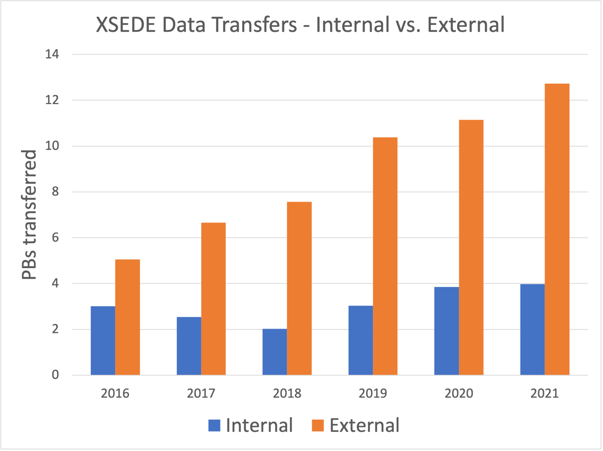

# Deploy Globus Endpoint v1

Infrastructure Integration Roadmap Task

**Task Type(s)**: Technology  
**Start by phase**: Integration  
**Complete by phase**: Operations  
**RP role(s)**: Data and networking contact(s), System administrator(s)

## Summary

A Globus endpoint connects a system to Globus and enables authorized researchers (members of an allocated project team) to transfer data to and from it using Globus. During the last two years of XSEDE, hundreds of researchers used Globus to transfer data to and from XSEDE resources as a part of their projects. A single transfer request may involve a single file or a million files. Individual requests were commonly 100 GB or more and frequently 1 TB or more. Requests of 10 TB or more happened daily. The other end of the data transfer may be a personal system, a campus system (hundreds of campuses have multi-user Globus endpoints and encourage their researchers to use them), or another HPC system (hundreds of national-scale service providers, e.g., DOE or non-US systems, have Globus endpoints). Globus enables researchers to perform transfers at these scales and is broadly available on the systems where research data is used.

### Effort

Operators role(s) that would typically perform this task:

- RP networking - design network connectivity/topology for data transfer nodes (DTNs)

- RP data services - identity storage systems available to DTNs, access policies, and performance requirements

- RP operations - deploy DTNs, install and configure Globus Connect Server, evaluate & optimize performance

The following estimates assume starting from scratch. If you have already deployed a Globus endpoint for your resource(s)—especially if the endpoint already uses Globus Connect Server 5.4 software—you will have significantly less work to do. In particular, performance evaluation and optimization should carry over from XSEDE to ACCESS with minimal change. GCS 5.4 endpoints can support both XSEDE and ACCESS using the same DTN and software with additional configuration.

The following assumes you have already acquired DTN servers with appropriate network interface(s) and memory, and network hardware with an appropriate topology for high-performance data transfers. Requirements for these should have been produced by roadmap task 2.1, *Data & Networking integration design*.

| Task                                                                                   | Estimated effort/time                          |
|----------------------------------------------------------------------------------------|------------------------------------------------|
| Deploy DTN hardware with the required network connectivity                             | 1 person-day effort (1 week start-to-finish)   |
| Provision local accounts on DTNs                                                       | 2 person-day effort (2 weeks start-to-finish)  |
| Mount and configure POSIX storage on DTNs                                              | 1 person-day effort (½ week start-to-finish)   |
| Install and configure Globus Connect Server on DTNs (inc. access policy configuration) | 1 person-day effort (1 week start-to-finish)   |
| Evaluate and optimize performance                                                      | 1 person-week effort (3 weeks start-to-finish) |

## Prerequisite tasks

None

## Support Information

For assistance with this task see the *Support Information* section in the *Integration Roadmap Description*.

## Detailed Instructions

The following assumes you have already performed roadmap task 2.1, *Data & Networking integration design.* That task should have produced requirements for DTN hardware (CPU, memory, network interfaces) and network topology (e.g., DTNs hosted in a high-bandwidth zone with connectivity to both the wide-area network and the RP’s data storage system(s)).

This also assumes you have acquired the necessary DTN servers and network hardware. (I.e., this doesn’t discuss acquiring hardware.)

### Deploy DTN hardware with the required network connectivity

Data Transfer Nodes (DTNs) are multiuser computer servers that run the data transfer software (Globus Connect Server) that handles the local end of data transfers to or from your data storage systems. Task 2.1, *Data and Networking integration design,* produced requirements for the RP’s Data Transfer Nodes (DTNs) based on how you anticipate ACCESS researchers will use your resource(s).

1.  Your operations personnel will deploy the DTN hardware (servers/nodes) in your data center.

2.  The network interfaces will be configured per the requirements from task 2.1. (This typically includes one interface to the RP’s high-bandwidth, wide-area network zone and a second interface to the zone where the RP’s data storage is connected.)

This step is complete when your data storage personnel can login to the DTNs and set up storage connectivity, your accounting or operations personnel can login and configure accounts for authorized researchers, and your networking personnel confirm the network interfaces are configured as expected.

### Provision local accounts on DTNs

*NOTE: We assume that individuals who are part of ACCESS projects that have allocations to use this resource are given local accounts on your resource. If this assumption is not valid for your resource, this section will need to be customized for your resource.*

Globus uses local accounts for primary data access.[^1] For primary data access to work as expected, individuals who are part of ACCESS projects that have allocations on this resource should have local accounts on the DTNs as well. In later steps, Globus will be configured to use these accounts.

1.  Your accounting or operations personnel will login to each DTN and configure the appropriate mechanism for provisioning local accounts. *Each RP has its own account mechanism, so ACCESS cannot provide detailed instructions.*

### Mount and configure POSIX storage on DTNs

POSIX-accessible data storage must be mounted on the DTNs to be accessible by Globus.[^2] Task 2.1, *Data and Networking integration design,* identified the POSIX storage system(s) on your resource that should be accessible for data transfers.

1.  Your data storage personnel will login to each DTN and configure the appropriate POSIX mounts for POSIX data storage that should be accessible for data transfers per the requirements produced by task 2.1.

2.  Tape archives, HPSS, GPFS, and other mass storage systems may have special tuning parameters and configuration interfaces. If these storage systems are intended to be accessible for data transfers, the requirements produced by task 2.1 should include guidance regarding performance tuning parameters and other settings.

### Install/configure Globus Connect Server on DTNs

Globus Connect Server is the software that connects your storage system(s) to Globus so researchers can use Globus to request data transfers to and from your resource. Globus Connect Server supports multi-DTN configurations, both to simplify DTN maintenance (adding/removing DTNs without disrupting transfers) and to enhance performance (Globus will use all available DTNs for transfers). Globus Connect Server can be used with POSIX-mounted data storage or (with optional subscription add-ons) a wide variety of object storage (e.g., OpenStack Ceph, BlackPearl, ActiveScale), cloud storage (AWS, Google, and Microsoft), and specialized research data storage systems (iRODS, Hadoop HDFS).

Globus Connect Server features modular configuration with a variety of access policies, so you can configure a single Globus Connect Server installation to (separately) support a series of distinct communities (ACCESS being one of these communities) that each have distinct IAM and data access policies.

ACCESS provides an IAM policy and support mechanisms that enable RPs to map individual members of ACCESS-allocated projects to local accounts. Task 2.1, *Data and Networking integration design,* identified your data access policies for data transfers.

Guidance for installing and configuring Globus Connect Server for use with ACCESS is available in the [**ACCESS Globus Connect Server Installation Guide**](https://docs.google.com/document/d/1PXTSTcTgsiPCCGvIH3ScavhwI41fkgu6QKZBRU8V918/edit#). The ACCESS guide provides ACCESS-specific guidance, but for general Globus instructions it frequently refers to Globus’s [**Globus Connect Server v5 Installation Guide**](https://docs.globus.org/globus-connect-server/v5.4/), so your personnel will need both resources for complete instructions.

A summary of the steps for installing and configuring Globus Connect Server for use with ACCESS follows.

1.  Your DTN administrator(s) will install the Globus Connect Server packages and ACCESS’s OAuth Mapfile utility package on each DTN using the native package management system.

2.  Your DTN administrator will configure the ACCESS OAuth Mapfile tool to generate and continuously update a table that maps ACCESS identities to the corresponding local accounts.

3.  On one DTN, your DTN administrator will create a *storage gateway* that limits access to storage systems per your ACCESS data transfer policy, identified in task 2.1.

4.  On one DTN, your DTN administrator will create one or more *collections* within the ACCESS storage gateway. Each collection provides data access to a specific data storage area per your data access policy.

5.  On any remaining DTNs, your DTN administrator will install a copy of the configuration key file from the first DTN, adding each DTN to the logical Globus endpoint and synchronize configurations across all participating DTNs.

### Evaluate and optimize performance

After your Globus endpoint is set up and configured, you should evaluate the performance of the endpoint to confirm that it satisfies the requirements determined in task 2.1. Test endpoints were deployed as part of ESnet’s 2019-2021 Data Mobility Workshop & Exhibition. They are hosted by a variety of well-connected institutions, are pre-loaded with sample reference datasets, and the endpoints and reference datasets are [*listed on the Globus website*](https://www.globusworld.org/tour/data-mobility-exhibition).

To evaluate whether your endpoint is performing as expected or not, the simplest method would be to repeat a variety of transfers from the test endpoints to your new endpoint (or vice-versa, with write-enabled test endpoints). **Hint:** You can use Globus’s [*Timer feature*](https://www.globus.org/blog/scheduled-and-recurring-transfers-now-available-globus-web-app) to schedule a transfer to repeat at preset intervals and collect the results later from the [*Timers tab on the Activity page*](https://app.globus.org/activity/timers). Set multiple timers with different endpoints and reference datasets and compare results.

## Document Management

**Status**: Official

**Official date**: 4/24/2023 2/15/2023

**Coordinators**: Lee Liming, ACCESS Operations

**Last revised date**: 2/3/2023

**Retired date**:

[^1]: Globus has a secondary data access mode, guest collections, which does not require local accounts. Guest collections are discussed in ACCESS’s Globus Connect Server install guidance, but are at a level of detail beneath what this roadmap discusses.

[^2]: Non-POSIX data storage (object storage and cloud storage) are generally not mounted but can be made accessible via Globus if the Globus subscription includes the relevant storage connector. Access to non-POSIX storage is configured in Globus Connect Server.
